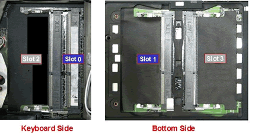

# lenovo thinkpad t520

[data](https://support.lenovo.com/by/en/solutions/pd015761)

successfully installed [Intel-Core-i7-2760QM](https://ark.intel.com/products/53474/Intel-Core-i7-2760QM-Processor-6M-Cache-up-to-3_50-GHz)
 1600DDR + 3.5 ghz

---
 ## [memory - which slots to use](https://forums.lenovo.com/t5/ThinkPad-P-and-W-Series-Mobile/Optimizing-memory-in-W510-which-slots-to-use/ta-p/249257?lightbox-message-images-249257=302iF4BE9341F0C7FF14)
 
 
 For ThinkPad W510 systems, populate memory DIMM slots in the following order:

    For systems with only 1 memory DIMM installed, populate DIMM Slot 0 (the upper memory DIMM slot underneath the keyboard).

     
    For systems with 2 memory DIMMs installed, place the largest memory DIMM capacity into DIMM Slot 0, and place the second memory DIMM in DIMM Slot 1 (the memory DIMM slot under the DIMM door on the bottom of the system nearest the optical drive).

     
    For systems with 3 memory DIMMs installed, place the largest memory DIMM into DIMM slot 0, place the second largest DIMM in DIMM slot 1, and place the third memory DIMM in DIMM Slot 2 (the lower memory DIMM slot underneath the keyboard).

 

    For systems with 4 memory DIMMs installed, place the largest memory DIMM into DIMM slot 0, place the second largest DIMM in DIMM slot 1, place the third largest DIMM in DIMM Slot 2, and place the fourth DIMM in DIMM Slot 3 (the memory DIMM slot underneath the DIMM door on the bottom of the system nearest the 1394 port).

Essentially, populate the ram in pair (slot 0 + 1 or slot 2 +3) to get the best dual channel performance. Also, make sure you get ram pair that has the same speed rating, i.e. 1333 mhz DDR3 ram should pair with 1333 mhz ram, and 1066 mhz ram with 1066 mhz ram, in either slot 0+1 or slot 2+3.