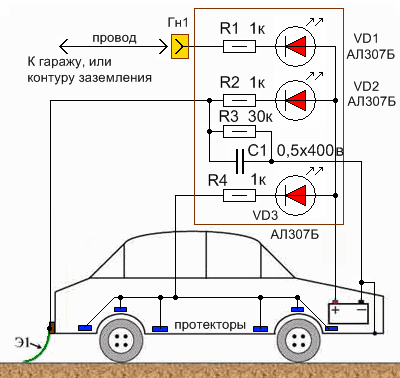

# rust 

[rust fix link](http://www.meanders.ru/katod_zashita.shtml)

content:

Предлагаю оптимальное устройство катодной защиты, использующее все варианты анодов, которое фактически не разряжает аккумулятор, что особенно важно при длительном хранении автомобиля. Время использования может составлять до бесконечности, пока сам аккумулятор не умрёт своей смертью, даже если регулярно четвероногий друг будет мочиться на протекторы.
За шаблон, на котором мы изобразим схему, мы возьмём предыдущее схематичное изображение автомобиля, доработав его простой, но "толковой" схемой защиты.
Устройство позволяет поддерживать значение потенциала влажных участков поверхности кузова на уровне, необходимом для полной остановки и прекращения коррозийных процессов за счет разрушения защитных электродов, в качестве которых выступают стенки металлического гаража, защитные протекторы. Кроме того, во время осадков в качестве защитного анода используется и мокрая поверхность дорожного полотна.

В схеме имеется три цепи защиты:
Первая цепь катодной защиты – цепь "стационарной" защиты с использованием контура заземления, или корпуса металлического гаража (ракушки). Является самым эффективным способом защиты автомобиля от коррозии в условиях "парника" металлического гаража. Применяется с дополнительным проводом, подключаемым одним концом в гнездо Гн1, другим соединяется с соответствующим анодом. Гнездо Гн1 можно расположить в любом удобном для Вас месте автомобиля. Удобнее всего – в салоне, у водительского места. В состав первой "стационарной" цепи защиты входят светодиод VD1, резистор R1, гнездо Гн1 и многожильный монтажный изолированный провод. Если у Вас нет условий для использования этого вида защиты, не переживайте, значит у Вас и нет металлического гаража, а так же есть остальные цепи защиты.
Вторая цепь катодной защиты – цепь "мобильной" защиты с использованием заземляющего «хвоста». Это наиболее эффективная защита от коррозии во время дождя, тумана, мокрого дорожного полотна. Электрод-хвост располагается сзади автомобиля, на одной линии с колесом, для того, чтобы брызги воды от колеса попадали на хвост. В состав второй "мобильной" цепи защиты входят светодиод VD2, резистор R2, изолятор (на рисунке - коричневый), заземляющий электрод - хвост Э1. Дополнительно в состав второй цепи входят элементы R3 и С1, которые совместно с Э1 выполняют функцию защиты кузова автомобиля от статического напряжения. Обратите внимание, что хвост прицепляется не непосредственно к металлическому кузову автомобиля, а через изоляционный материал. В качестве хвоста используйте тонкую металлизированную резиновую ленту. Как вариант, можно использовать тонкостенный резиновый шланг с продетым в него тонким металлическим тросиком, выглядывающим на конце.

Третья цепь катодной защиты – цепь "постоянной" защиты от коррозии с использованием протекторных пластин. Эта защита от коррозии действует постоянно, как на стоянке, так и в движении, как во время дождя, так и в сухую погоду. Её эффективность зависит от количества, размеров и мест расположения пластин-электродов. Чем суммарная площадь электродов больше, тем лучше. Но учтите, что электроды должны быть распределены по кузову автомобиля в наиболее уязвимых для коррозии местах. О самих протекторах было написано выше. Наиболее приемлемый не дорогой материал для протекторов – нержавеющая сталь. В состав третьей "постоянной" цепи защиты входят светодиод VD3, резистор R4 и протекторы (на рисунке - синие). Пластины крепят на клей, но думаю, что конструкция на болтах будет работать не хуже и при умелом соединении, безусловно, будет надёжнее.
Номиналы резисторов R1, R2, R4 схемы защиты выбраны такими, чтобы в случае замыкания протекторов, хвоста, или гаражной конструкции на кузов автомобиля максимальный ток был ограничен номинальным значением тока светодиодов – 10mA. Другими словами, в условиях сухого воздуха (сухого кузова автомобиля) светодиоды не должны гореть. Если в сырую погоду, светодиоды загораются, то это свидетельствует о работе катодной защиты. Чем больше влажности, тем ярче будут гореть светодиоды. Если один из светодиодов горит максимально ярко на "сухом" автомобиле, то это означает, что имеет место неисправность – замыкание элементов защиты от коррозии на корпус автомобиля. Тогда необходимо, не позднее чем в течение недели после загорания светодиода определить место замыкания и устранить его. Основное назначение светодиодов – контроль исправности цепей катодной защиты. В условиях минимального воздействия влаги они не должны ярко светиться. Слабое свечение допускается.
Проверку исправности цепей защиты на обрыв проводят приблизительно 1 раз в месяц путем замыкания на корпус автомобиля: первую цепь проверяют замыканием провода, который должен крепиться к стенке металлического гаража; вторую – замыканием заземляющего хвоста; третью – замыканием одного из протекторов. При замыкании, соответствующий светодиод должен загореться. Для удобства, можно использовать дополнительный монтажный провод. Неплохо, при проверке исправности схемы катодной защиты ещё и осмотреть защитные протекторы.
Само нехитрое устройство можно разместить в любом удобном для Вас месте. Нет необходимости размещать его на панели приборов, перед глазами водителя. Там оно будет только отвлекать. Устройство защиты, размещённое в моторном отсеке, не позволит своевременно отреагировать на замыкание анодов на корпус автомобиля, потому как многие не заглядывают под капот своего коня от одной, до другой смены масла в двигателе. Поэтому, по моему мнению, оптимальное место расположения устройства – под приборной панелью, в нише, на 10-20 сантиметров выше педалей управления. Перед выходом из машины, водитель обычно опускает глаза для изъятия ключа из замка зажигания, поэтому светодиоды устройства защиты окажутся в поле его зрения. А красный горящий светодиод обязательно привлечёт внимание.
Необходимо, чтобы устройство оставалось подключенным к аккумулятору даже при отключенном общем электрооборудовании автомобиля (выключенном зажигании). В простейшем случае устройство можно расположить на небольшой изоляционной пластине (гетинакс, текстолит, пластмасса). Лучший вариант, если устройство поместить в какую-либо изолированную коробочку, или залить эпоксидной смолой.

