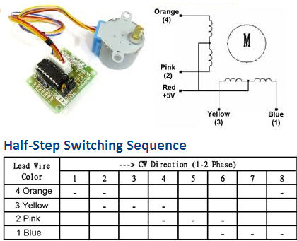
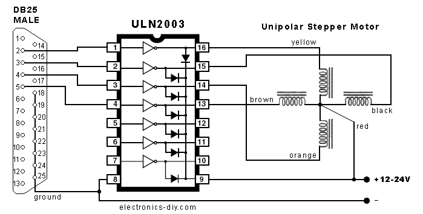

# The ULN2003APG/AFWG Series 

are high voltage, high current darlington drivers comprised of seven NPN darlington pairs. 

All units feature integral clamp diodes for switching inductive loads. 

Applications include relay, hammer, lamp and display (LED) drivers. 

на микросхему до 40 вольт можно подавать 30 мА постоянного и 100мА импульсного тока на 1 ключ, у меня есть и в дип 16 7 ключей и в бга - там 8 ключей

* Could be used to drive step motors

[datasheet](r-uln2003apg/ULN2003APG.pdf)

