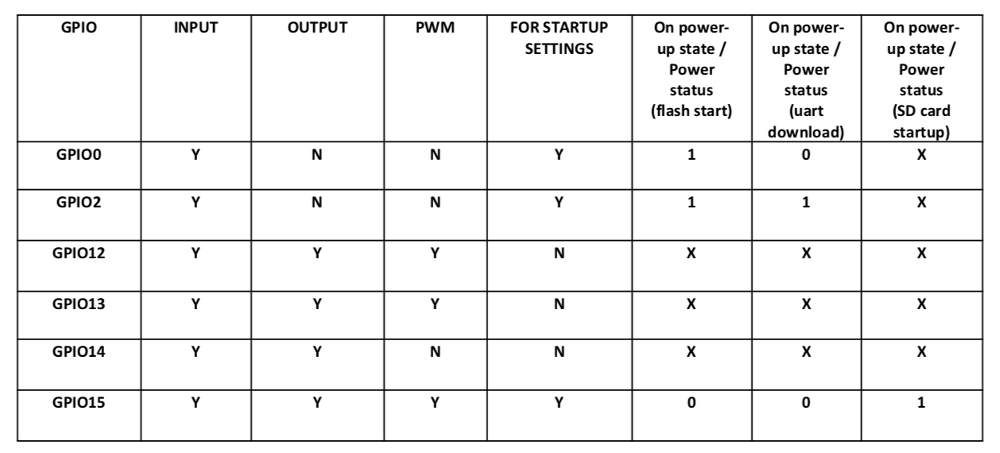

# Arduino lib

[github source code and wiki](https://github.com/esp8266/Arduino)

# UART drivers

[CP210x](r-espCoding/Mac_OSX_CP2102_Driver.zip)
[CH34x](r-espCoding/CH34x_Install_V1.3.zip)

# Mesh network esp 

[source lib](https://platformio.org/lib/show/1747/ESP8266MQTTMesh)

# boot modes



boot mode(x, 6)  SDIO-boot from sdcard, looks like secon digit 6 mean boot

7
SDIO HighSpeed V2 IO
Uart1 Booting

6
SDIO LowSpeed V1 IO
Uart1 Booting

5
SDIO HighSpeed V1 IO
Uart1 Booting

4
SDIO LowSpeed V2 IO
Uart1 Booting

3
FLASH BOOT

2
Jump Boot

1
UART Boot

0
Remapping


# ESP8266 Pins list function, register, strapping

[source](https://esp8266.ru/esp8266-pin-register-strapping/)

# platform io ini

```
[env:nodemcu]
platform = espressif8266
board = nodemcu // esp12e// nodemcuv2
framework = arduino
upload_speed = 460800
```