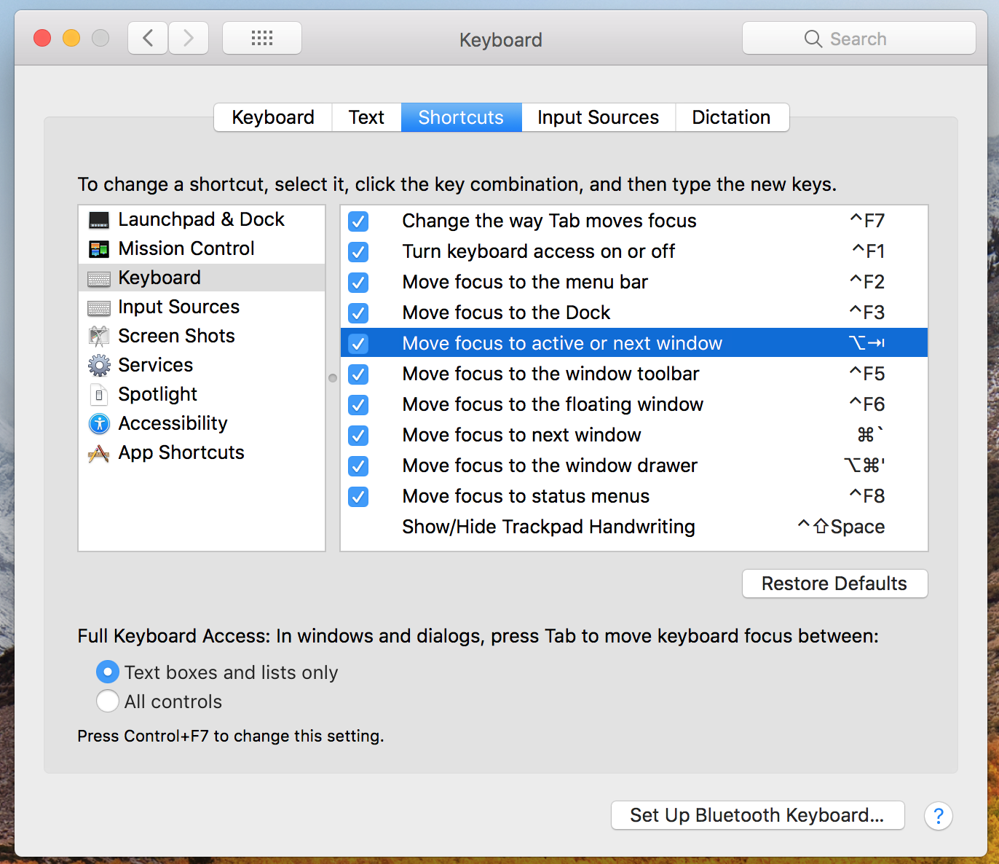

# Development setup

bucha - git repo (git submodule update src/repo --recursive)

-> projects git repo

-> old-projects git repo

Applications

Mac, iOS - xCode

node.js - Visual Studio code https://code.visualstudio.com/

IOT - Platform.io. http://platformio.org/

SourceTree

launcher (App Store)

Sketch + CraftManager

Keka archive manager

iTerm

Logic (IOT Logic Analizer)

VLC

uTorrent

4KVideoDownloader

[Etcher](https://etcher.io/) make bootable usb drives

# UI setup

## the trackpad speed

The value of the preference is stored in ~/Library/Preferences/.GlobalPreferences.plistand can be changed with something like defaults write -g com.apple.trackpad.scaling -float 5.0. The normal maximum value is currently 3.0. Applying the changes requires logging out and back in.

## the resolution

[Guide tonymacx86.com](https://www.tonymacx86.com/threads/guide-add-your-custom-retina-hidpi-resolution-for-your-desktop-display.102321/)
 Add your custom retina / HiDPI resolution for your desktop display
Hi. Excuse me for my English. I'm trying to make it simple. 1, Prepare SwitchResX, PlistEdit Pro and IORegExplorer. SwitchResX is not a must but I...

apps:

* SetResX - free

* Display menu (appstore) freemium

* SwitchResX - full of stuff - payed

* best - write an app yourself

Changing Display Modes (OS X v10.6 or later)
[developer.apple.com](https://developer.apple.com/library/content/documentation/GraphicsImaging/Conceptual/QuartzDisplayServicesConceptual/Articles/DisplayModes.html#//apple_ref/doc/uid/TP40004234-SW1)

Shows how to configure and control display hardware using Quartz Display Services. 

# mac OS turn bluetooth off by default

```cmd

sudo defaults write /Library/Preferences/com.apple.Bluetooth.plist ControllerPowerState 0

```

[forum](https://discussions.apple.com/message/22250717#message22250717)

[stackexchange](https://apple.stackexchange.com/questions/260562/how-do-you-turn-off-bluetooth-on-startup-using-macbook-air-and-macos-sierra/264269#264269)

# MacOS create bootable flash

## [source 1](http://betanews.com/2016/09/21/how-to-create-macos-sierra-bootable-usb-drive/)

Connect the USB drive to your Mac.
Using Disk Utility (it is typically found in the Other folder, under Launchpad), format the USB drive as Mac OS Extended (Journaled), using the GUID Partition Mac scheme, and name it macOSSierra. This can be done from the Erase tab within the app; make sure that there are no multiple partitions (turn to the Partition tab to verify and correct this).
Open Terminal (it is found in the same folder as the Disk Utility app).
Use (paste) the following command: 


```cmd
sudo /Applications/Install\ macOS\ Sierra.app/Contents/Resources/createinstallmedia --volume /Volumes/macOSSierra --applicationpath /Applications/Install\ macOS\ Sierra.app --nointeraction.
```
Type in your user password, when required, to start the process.


## [source 2](http://blog.tinned-software.net/create-bootable-usb-stick-from-iso-in-mac-os-x/)

### mark disk as bootable

```cmd
$ sudo fdisk -e /dev/rdisk2


fdisk: could not open MBR file /usr/standalone/i386/boot0: No such file or directory
Enter 'help' for information
fdisk: 1> f 1
Partition 1 marked active.
fdisk:*1> write
Writing MBR at offset 0.
fdisk: 1> exit
```

### list all disks

```cmd
$ df -h
```

### unmount

```cmd
$ sudo diskutil umount /dev/disk2
$ sudo diskutil umount /dev/disk2s2
```


### convert to disk image

```cmd
$ hdiutil convert mini.iso -format UDRW -o mini.img
```

### write disk image to disk

```cmd
$ sudo dd bs=1m if=mini.iso of=/dev/rdisk2
$diskutil eject /dev/disk2
```

### erase whole device

```cmd
$ diskutil eraseDisk fat32 DISK MBR /dev/disk2
partition device
$ diskutil partitionDisk /dev/disk2 GPT JHFS+ New 0b
```

# macOS three finger drag

Here's how to turn on three finger drag if your Mac has a Force Touch trackpad.
From the Apple menu, choose System Preferences.
Click the Accessibility icon.
Choose Mouse & Trackpad from the options on the left.
Click Trackpad Options.
Place a checkmark next to "Enable dragging."
From the related pop-up menu, choose “three finger drag” so there's a checkmark next to it.
Click OK.

# MacOS disable logging

Edit the file /etc/asl.conf and find a line that looks like this
? [= Sender kernel] file system.log
and change it to
? [= Sender kernel] [<= Level error] file system.log
Send a HUP signal to the syslogd process (or just restart your system) and the logging behavior will be changed. Use pgrep from Terminal to find the process ID for syslogd. E.g.

```cmd
$ pgrep syslogd 21 $
```

Then send a HUP signal to that process ID with the kill program.

```cmd
$ sudo kill -HUP 21 $
```

Configuration file for syslogd and aslmanager

aslmanager logs

```cmd
/var/log/asl/Logs/aslmanager external style=lcl-b ttl=2
```
authpriv messages are root/admin readable
? [= Facility authpriv] access 0 80

remoteauth critical, alert, and emergency messages are root/admin readable
? [= Facility remoteauth] access 0 80

broadcast emergency messages
? [= Level emergency] broadcast

save kernel [PID 0] and launchd [PID 1] messages
? [<= PID 1] store

ignore "internal" facility
? [= Facility internal] ignore

save everything from emergency to notice
? [<= Level emergency] store

Rules for /var/log/system.log

system.log mode=0640 format=bsd rotate=seq compress file_max=1M all_max=5M

? [= Sender kernel] [<= Level emergency] file system.log

? [<= Level emergency] file system.log

? [= Facility auth] [<= Level emergency] file system.log

? [= Facility authpriv] [<= Level emergency] file system.log

Facility com.apple.alf.logging gets saved in appfirewall.log

? [= Facility com.apple.alf.logging] [<= Level emergency] file appfirewall.log file_max=1M all_max=5M

# Mac OS switching beetwen windows



set keyboard shortcut in Keyboard section for Move focus to active or next window entry

I've assigned it to ⌥⇥ myself, and assigned ⌥T to what ⌥⇥ would do normally: 

```
d=~/Library/KeyBindings; mkdir -p $d; echo $'{\n\t"~t" = insertTabIgnoringFieldEditor:;\n}' > $d/DefaultKeyBinding.dict.
```

# disable spotlight

To have mds ignore all external volumes including network volumes run the following command:

```cmd
$ sudo defaults write /Library/Preferences/com.apple.SpotlightServer.plist ExternalVolumesIgnore -bool True
```

To be able to re-enable indexing for certain external volumes, run this command instead:

```cmd
$ sudo defaults write /Library/Preferences/com.apple.SpotlightServer.plist ExternalVolumesDefaultOff -bool True
```

Disable all permanent

```cmd
sudo mdutil -a -i off
```

# keyboard reapeat

terminal

```cmd
defaults write -g InitialKeyRepeat -int 8 # normal minimum is 15 (225 ms) 
defaults write -g KeyRepeat -int 1 # normal minimum is 2 (30 ms)
```


# Mac Apps List

```
Adobe Bridge CS4
Adobe Extension Manager CS4
Adobe Photoshop CS4
Android Studio 2.2.app
Brackets.app
Fabric.app
FileZilla.app
Font Book.app
GIMP.app
Keka.app
MySQLWorkbench.app
Sketch.app
Skype.app
SourceTree.app
Spectacle.app
Tomahawk.app
Transmission.app
Vivaldi.app
Xcode.app
pomowork.app
uTorrent.app
uTox.app

032517.p12  Keka.app  SourceTree.app
4K Video Downloader.app	Launchpad.app  Stickies.app
App Store.app  Logic.app  Sublime Text.app
Arduino.app  MacVim.app  System Preferences.app
Automator.app  Mail.app  TeamViewer.app
Calculator.app  Maps.app  Telegram.app
Calendar.app  Messages.app  TextEdit.app
Chess.app  Mission Control.app	Time Machine.app
Contacts.app  No-IP DUC.app  TorBrowser.app
DVD Player.app  Notes.app  Utilities
Dashboard.app  Photo Booth.app  VLC.app
Deluge.app  Photos.app  Xcode.app
Dictionary.app  Preview.app  astah community
DjView.app  QuickTime Player.app	cpuinfo.app
Dropbox.app  Reminders.app  iBooks.app
FaceTime.app  Safari.app  iTerm.app
Font Book.app  Siri.app  iTunes.app
Google Chrome.app	Sketch.app  pomowork.app
Image Capture.app	Skype.app  uTorrent.app
```